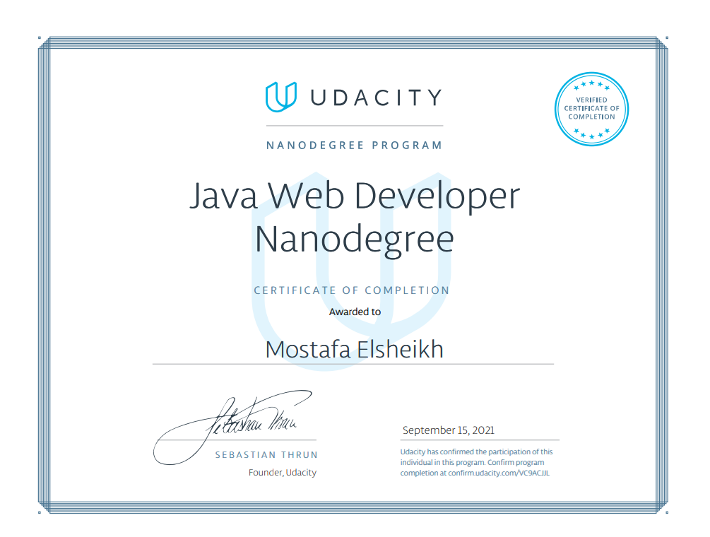

# Udacity Java Web Developer Nanodegree

My project work for the [Java Web Developer Nanodegree by Udacity](https://www.udacity.com/course/java-developer-nanodegree--nd035).

* [Project 1 - **Super Duper Drive**](https://github.com/Sasa94s/superduperdrive-cloud-storage)
  * Web application implemented by SpringMVC and Thymeleaf
  * Upload, view or download files and store them in database.
  * List or manage files, notes, and credentials.
  * Using Spring Data, and H2 in-memory database
* [Project 2 - **Backend System for a Car Website**](https://github.com/Sasa94s/cars-microservices)
  * REST-API Microservices 
  * Cars management with integration with Microservices for Prices and Maps retrieval
  * Microservices registered as Netflix Eureka clients
  * Centralized documentation connected to all Microservices
  * Using Spring Data, MySQL database
* [Project 3 - **Critter Chronologer**](https://github.com/Sasa94s/critter-chronologer)
  * REST-API Webservices
  * Lists and manages the Pets, Employees, Customers, and Schedules.
  * Using Spring Data, and H2 in-memory database
* [Project 4 - **eCommerce Application**](https://github.com/Sasa94s/e-commerce-app)
  * Secured REST-API Webservices [deployed](https://github.com/Sasa94s/e-commerce-app/blob/master/CI-CD.md) on Docker containers using Jenkins pipeline
  * Lists and manages the Users, Shopping Items, Shopping Carts and Views Users' Orders history. 
  * Using Spring Security, and H2 in-memory database
